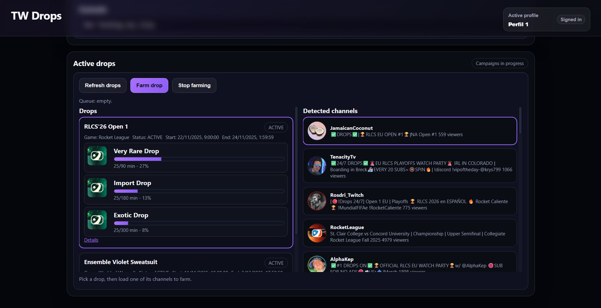

# TW Drops: Twitch Drops Farmer (So Ugly It Works)

Welcome to **TW Drops**, the scrappy Twitch drops farmer that drives a headless Playwright browser for you. It captures cookies, shows account stats, lists active campaigns, fetches live channels, and farms drops in the background — all from a slick control panel. The codebase is a bit of a beautiful disaster, but *if it works, don’t touch it.*



## Why You Might Actually Like This
- **Cookie capture + stats**: Grab `auth-token`, view Twitch account info (display name, affiliate/partner, created at, bio, avatar).
- **Drops dashboard**: Active campaigns with progress bars and reward details; auto-fetches live channels for the selected game/drop.
- **Background farming**: Opens the stream, mutes/plays, queues channels, and keeps running per-profile.
- **Multi-profile isolation**: Each profile keeps its own Chrome data and cookies; switch/create/delete from the header.
- **Lightweight auth gate**: First-run register, then login; stored in the data volume so randos can’t just hit your port.
- **Docker-ready**: Base image includes Playwright/Chromium; mount a volume for persistent cookies/auth.

## Quickstart (Local)
```bash
npm install
npm start
# open http://localhost:3000
```
First visit will ask you to register a user/pass. After logging in:
1) Create/select a profile (header).
2) Open the embedded browser, log into Twitch.
3) Capture cookies.
4) Refresh drops, pick a drop/channel, start farming.

## Docker (multi-arch image ready)
Pull & run the published image:
```bash
docker run -p 3000:3000 -v twdrops_profile:/app/.twdrops-profile amintikk/twdrops:latest
```

## Auth & Persistence
- Auth data and cookies live in `.twdrops-profile/` (or the mounted volume in Docker).
- On first run, register at `/auth/register`; afterwards use `/auth/login`.
- The WebSocket is also auth-guarded.

## Scripts
- `npm start` — run server (Express + Playwright + static frontend).

## Disclaimer
- Use at your own risk. This is not affiliated with Twitch.
- Respect Twitch ToS and local laws.
- No warranties; you own the consequences.

Happy farming. Or at least, farming that mostly works.
